# DeepFaceLab-Runpod
DeepFaceLab is the leading software for creating deepfakes.

# From a fresh Pod:

### If you don't have an account yet, [follow the link](https://runpod.io?ref=590sx73q) to register and use this beauty.

Create pod from ***"RunPod Desktop"*** template, at least 30GB for volume and container disk sizes, as both will be used to create the environment later.

Click **"Connect"**, **"Start Web Terminal"** and open a terminal by clicking **"Connect to Web Terminal"**, copy-paste the whole line below, hit enter:

```terminal
wget https://repo.anaconda.com/miniconda/Miniconda3-py39_23.3.1-0-Linux-x86_64.sh; cd /; sudo chmod 777 /workspace; cd /workspace; git clone https://github.com/DaviSoEditando/DeepFaceLab-Runpod DeepFaceLab_Linux; bash /home/kasm-user/*.sh
```

Hit the spacebar a few times, answer yes to each question, set install location to **/home/kasm-user/miniconda3** (will probably already be), answer yes to the last question and finish the installation.

Quit terminal, open new one - should start with ‘base’, copy-paste the whole line below to create the conda environment that will be used, be patient as it will take a few minutes, hit enter:

```terminal
cd /home/kasm-user/miniconda3; conda env create -f /workspace/DeepFaceLab_Linux/scripts/environment.yaml; cd /workspace/DeepFaceLab_Linux/scripts/; cp -r /home/kasm-user/miniconda3 /workspace/
```
Now you can download your model and your videos, just go back to the Runpod page, click on **"HTTP Service [Port 6901] Not Ready"** which will open a new tab where you will put the login and password:  

```
login:    kasm_user 
password: password
```

A desktop will open remote and you can download using google chrome and then unzip the zip you downloaded using the command:

```
unzip /home/kasm-user/Desktop/Downloads/*.zip -d /workspace/DeepFaceLab_Linux/workspace/
```

--------------------------------------------------------
<details>

**<summary>Now just open a Terminal and run the scripts of your choice, some examples paths:</summary>**

<sub> **Extract imagem from data SRC** </sub>
```
cd /workspace/DeepFaceLab_Linux/scripts/; bash 2_extract_image_from_data_src.sh
```
<sub> **Extract imagem from data DST** </sub>
```
cd /workspace/DeepFaceLab_Linux/scripts/; bash 3_extract_image_from_data_dst.sh
```
<sub> **Extract faces from SRC** </sub>
```
cd /workspace/DeepFaceLab_Linux/scripts/; bash 4_data_src_extract_faces_S3FD.sh
```
<sub> **Extract faces and align from DST** </sub>
```
cd /workspace/DeepFaceLab_Linux/scripts/; bash 5_data_dst_extract_faces_S3FD.sh
```
<sub> **Train SAEHD** </sub>
```
cd /workspace/DeepFaceLab_Linux/scripts/; bash 6_train_SAEHD.sh
```
<sub> **Merge SAEHD** </sub>
```
cd /workspace/DeepFaceLab_Linux/scripts/; bash 7_merge_SAEHD.sh
```
<sub> **Merge to MP4** </sub>
```
cd /workspace/DeepFaceLab_Linux/scripts/; bash 8_merged_to_mp4.sh
```
</details>

# Restart after Pausing the Pod

After restarting the pod, just use the command below to create a link from the "miniconda3" folder on the system to get back to using DeepFaceLab again:

```
ln -s /workspace/miniconda3 /home/kasm-user
```

But only if you still have the Volume with the previous files.

If you have deleted the volume, you will have to do the whole process from the beginning.

# Tip

Runpod allows you to create a "Network Volume", in which you can keep the files, both from DeepFaceLab and the miniconda/env installation, that way you are not hostage to the same graphics card, as they tend to get busy quickly, making it very difficult rent again.
You will be charged a few cents a month per GB that you have in the generated volume and so far you can only use it in "Secure Cloud" mode.

I got most of these tips from this [forum](https://mrdeepfakes.com/forums/threads/guide-use-deepfacelab-on-runpod-desktop-with-the-linux-version.12394/page-2#posts), and spent the night trying to find the causes of the problems that occurred when trying to run the scripts in Runpod.

If you found this tutorial useful, I wouldn't be sad for you to transfer some eth to my wallet.😊

```
0x0d1F8774a408a3b06DB9aFB75961e5C01D37DE74
```

Hope this helps!

---------------------------------------------------------------


<table align="center" border="0">

<tr><td colspan=2 align="center">

# DeepFaceLab  

<a href="https://arxiv.org/abs/2005.05535">

</img>
https://arxiv.org/abs/2005.05535</a>


### the leading software for creating deepfakes


</td></tr>
<tr><td colspan=2 align="center">

<p align="center">


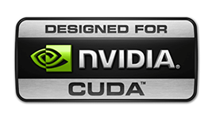
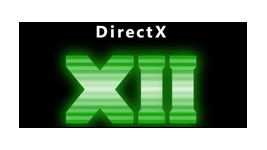

</p>

More than 95% of deepfake videos are created with DeepFaceLab.

DeepFaceLab is used by such popular youtube channels as

| [deeptomcruise](https://www.tiktok.com/@deeptomcruise)| [1facerussia](https://www.tiktok.com/@1facerussia)| [arnoldschwarzneggar](https://www.tiktok.com/@arnoldschwarzneggar)
|---|---|---|

| [mariahcareyathome?](https://www.tiktok.com/@mariahcareyathome?)| [diepnep](https://www.tiktok.com/@diepnep)| [mr__heisenberg](https://www.tiktok.com/@mr__heisenberg)| [deepcaprio](https://www.tiktok.com/@deepcaprio)
|---|---|---|---|

| [VFXChris Ume](https://www.youtube.com/channel/UCGf4OlX_aTt8DlrgiH3jN3g/videos)| [Sham00k](https://www.youtube.com/channel/UCZXbWcv7fSZFTAZV4beckyw/videos)|
|---|---|

| [Collider videos](https://www.youtube.com/watch?v=A91P2qtPT54&list=PLayt6616lBclvOprvrC8qKGCO-mAhPRux)| [iFake](https://www.youtube.com/channel/UCC0lK2Zo2BMXX-k1Ks0r7dg/videos)| [NextFace](https://www.youtube.com/channel/UCFh3gL0a8BS21g-DHvXZEeQ/videos)|
|---|---|---|

| [Futuring Machine](https://www.youtube.com/channel/UCC5BbFxqLQgfnWPhprmQLVg)| [RepresentUS](https://www.youtube.com/channel/UCRzgK52MmetD9aG8pDOID3g)| [Corridor Crew](https://www.youtube.com/c/corridorcrew/videos)|
|---|---|---|

| [DeepFaker](https://www.youtube.com/channel/UCkHecfDTcSazNZSKPEhtPVQ)| [DeepFakes in movie](https://www.youtube.com/c/DeepFakesinmovie/videos)|
|---|---|

| [DeepFakeCreator](https://www.youtube.com/channel/UCkNFhcYNLQ5hr6A6lZ56mKA)| [Jarkan](https://www.youtube.com/user/Jarkancio/videos)|
|---|---|

</td></tr>

<tr><td colspan=2 align="center">

# What can I do using DeepFaceLab?

</td></tr>
<tr><td colspan=2 align="center">

## Replace the face

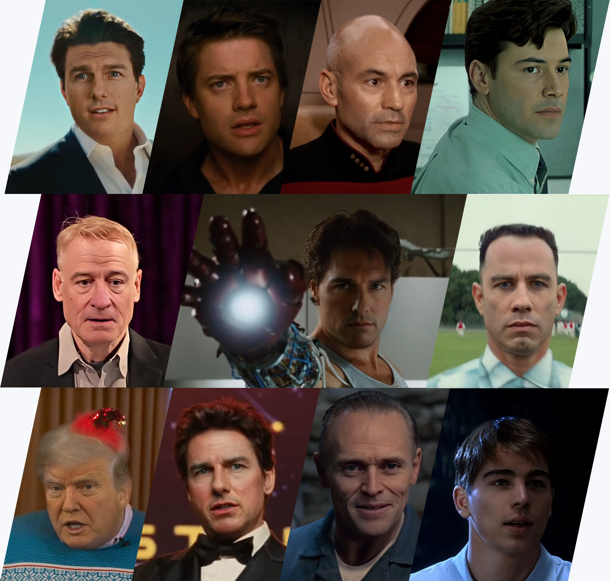

</td></tr>

<tr><td colspan=2 align="center">

## De-age the face

</td></tr>

<tr><td align="center" width="50%">

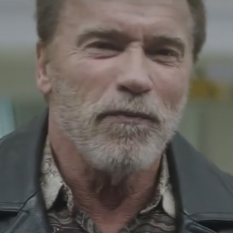

</td>
<td align="center" width="50%">

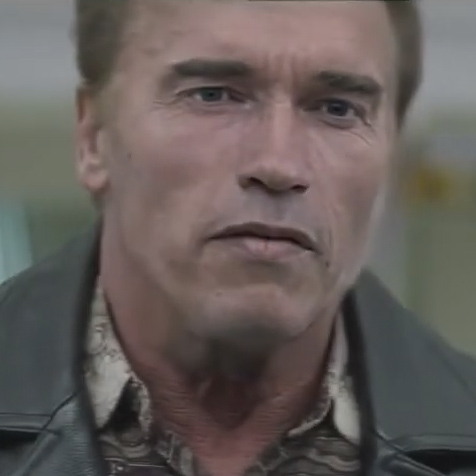

</td></tr>

<tr><td colspan=2 align="center">

 https://www.youtube.com/watch?v=Ddx5B-84ebo

</td></tr>

<tr><td colspan=2 align="center">

## Replace the head

</td></tr>


<tr><td align="center" width="50%">


</td>
<td align="center" width="50%">

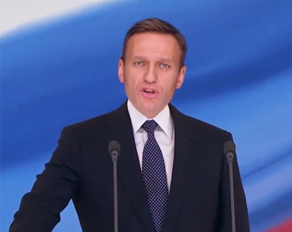

</td></tr>

<tr><td colspan=2 align="center">

 https://www.youtube.com/watch?v=xr5FHd0AdlQ

</td></tr>

<tr><td align="center" width="50%">

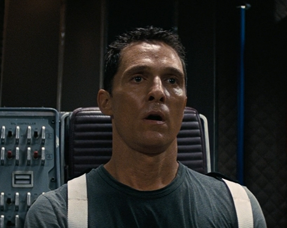

</td>
<td align="center" width="50%">

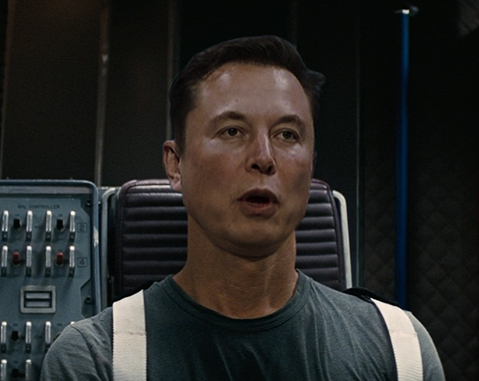

</td></tr>

<tr><td colspan=2 align="center">

 https://www.youtube.com/watch?v=RTjgkhMugVw

</td></tr>

<tr><td align="center" width="50%">


</td>
<td align="center" width="50%">

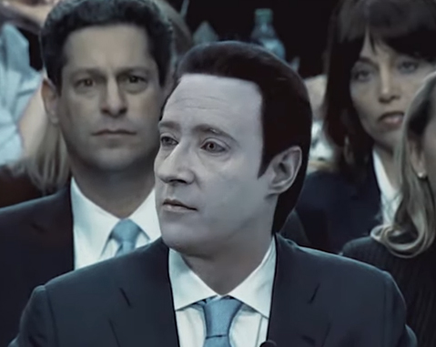

</td></tr>

<tr><td colspan=2  align="center">

 https://www.youtube.com/watch?v=R9f7WD0gKPo

</td></tr>


<tr><td colspan=2 align="center">

## Manipulate politicians lips
(voice replacement is not included!)
(also requires a skill in video editors such as *Adobe After Effects* or *Davinci Resolve*)


 https://www.youtube.com/watch?v=IvY-Abd2FfM


 https://www.youtube.com/watch?v=ERQlaJ_czHU

</td></tr>
<tr><td colspan=2 align="center">

# Deepfake native resolution progress

</td></tr>
<tr><td colspan=2 align="center">

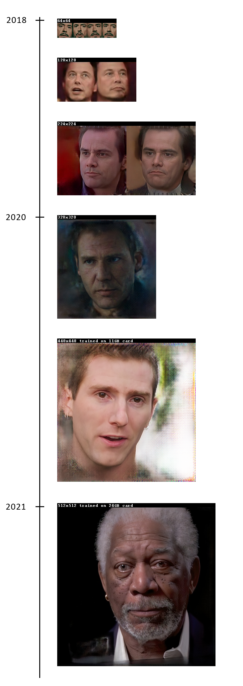

</td></tr>
<tr><td colspan=2 align="center">


Unfortunately, there is no "make everything ok" button in DeepFaceLab. You should spend time studying the workflow and growing your skills. A skill in programs such as *AfterEffects* or *Davinci Resolve* is also desirable.

</td></tr>
<tr><td colspan=2 align="center">

## Mini tutorial

<a href="https://www.youtube.com/watch?v=kOIMXt8KK8M">

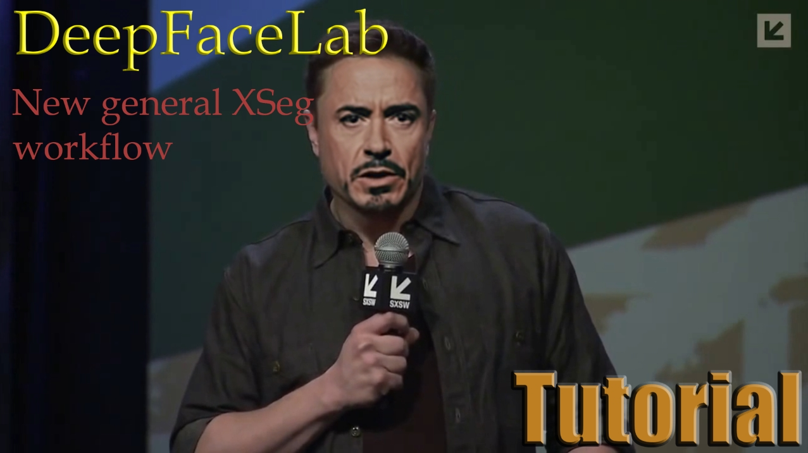

</a>

</td></tr>
<tr><td colspan=2 align="center">

## Releases

</td></tr>

<tr><td align="right">
<a href="https://tinyurl.com/2p9cvt25">Windows (magnet link)</a>
</td><td align="center">Last release. Use torrent client to download.</td></tr>

<tr><td align="right">
<a href="https://mega.nz/folder/Po0nGQrA#dbbttiNWojCt8jzD4xYaPw">Windows (Mega.nz)</a>
</td><td align="center">Contains new and prev releases.</td></tr>

<tr><td align="right">
<a href="https://disk.yandex.ru/d/7i5XTKIKVg5UUg">Windows (yandex.ru)</a>
</td><td align="center">Contains new and prev releases.</td></tr>

<tr><td align="right">
<a href="https://github.com/chervonij/DFL-Colab">Google Colab (github)</a>
</td><td align="center">by @chervonij . You can train fakes for free using Google Colab.</td></tr>

<tr><td align="right">
<a href="https://github.com/nagadit/DeepFaceLab_Linux">Linux (github)</a>
</td><td align="center">by @nagadit</td></tr>

<tr><td align="right">
<a href="https://github.com/elemantalcode/dfl">CentOS Linux (github)</a>
</td><td align="center">May be outdated. By @elemantalcode</td></tr>

</table>

<table align="center" border="0">

<tr><td colspan=2 align="center">

## Links

</td></tr>

<tr><td colspan=2 align="center">

### Guides and tutorials

</td></tr>

<tr><td align="right">
<a href="https://mrdeepfakes.com/forums/thread-guide-deepfacelab-2-0-guide">DeepFaceLab guide</a>
</td><td align="center">Main guide</td></tr>

<tr><td align="right">
<a href="https://mrdeepfakes.com/forums/thread-guide-deepfacelab-2-0-guide?pid=18459#pid18459">Faceset creation guide</a>
</td><td align="center">How to create the right faceset</td></tr>

<tr><td align="right">
<a href="https://mrdeepfakes.com/forums/thread-guide-deepfacelab-google-colab-tutorial">Google Colab guide</a>
</td><td align="center">Guide how to train the fake on Google Colab</td></tr>

<tr><td align="right">
<a href="https://mrdeepfakes.com/forums/thread-deepfacelab-2-0-compositing-in-davinci-resolve-vegas-pro-and-after-effects">Compositing</a>
</td><td align="center">To achieve the highest quality, compose deepfake manually in video editors such as Davinci Resolve or Adobe AfterEffects</td></tr>

<tr><td align="right">
<a href="https://mrdeepfakes.com/forums/thread-deepfacelab-2-0-discussion-tips-suggestions">Discussion and suggestions</a>
</td><td align="center"></td></tr>

<tr><td colspan=2 align="center">

### Supplementary material

</td></tr>

<tr><td align="right">
<a href="https://mrdeepfakes.com/forums/forum-celebrity-facesets">Ready to work facesets</a>
</td><td align="center">Celebrity facesets made by community</td></tr>

<tr><td align="right">
<a href="https://mrdeepfakes.com/forums/forum-trained-models">Pretrained models</a>
</td><td align="center">Pretrained models made by community</td></tr>

<tr><td colspan=2 align="center">

### Communication groups

</td></tr>

<tr><td align="right">
<a href="https://discord.gg/rxa7h9M6rH">Discord</a>
</td><td align="center">Official discord channel. English / Russian.</td></tr>

<tr><td align="right">
<a href="https://t.me/joinchat/ElkhqlgJ0I5HhdJyFar80w">Telegram group</a>
</td><td align="center">Official telegram group. English / Russian. For anonymous communication. Don't forget to hide your phone number</td></tr>

<tr><td align="right">
<a href="https://mrdeepfakes.com/forums/forum-russian-community">Русский форум</a>
</td><td align="center"></td></tr>

<tr><td align="right">
<a href="https://mrdeepfakes.com/forums/">mrdeepfakes</a>
</td><td align="center">the biggest NSFW English community</td></tr>

<tr><td align="right">
<a href="https://www.reddit.com/r/DeepFakesSFW/new/">reddit r/DeepFakesSFW/</a>
</td><td align="center">Post your deepfakes there !</td></tr>

<tr><td align="right">
<a href="https://www.reddit.com/r/RUdeepfakes/new/">reddit r/RUdeepfakes/</a>
</td><td align="center">Постим русские дипфейки сюда !</td></tr>

<tr><td align="right">
QQ群124500433
</td><td align="center">中文交流QQ群，商务合作找群主</td></tr>

<tr><td align="right">
<a href="https://www.dfldata.cc">dfldata.cc</a>
</td><td align="center">中文交流论坛，免费软件教程、模型、人脸数据</td></tr>

<tr><td align="right">
<a href="https://www.deepfaker.xyz/">deepfaker.xyz</a>
</td><td align="center">中文学习站（非官方)</td></tr>

<tr><td colspan=2 align="center">

## Related works

</td></tr>

<tr><td align="right">
<a href="https://github.com/iperov/DeepFaceLive">DeepFaceLive</a>
</td><td align="center">Real-time face swap for PC streaming or video calls</td></tr>

<tr><td align="right">
<a href="https://github.com/neuralchen/SimSwap">neuralchen/SimSwap</a>
</td><td align="center">Swapping face using ONE single photo 一张图免训练换脸</td></tr>

<tr><td align="right">
<a href="https://github.com/deepfakes/faceswap">deepfakes/faceswap</a>
</td><td align="center">Something that was before DeepFaceLab and still remains in the past</td></tr>

</td></tr>
</table>

<table align="center" border="0">

<tr><td colspan=2 align="center">

## How I can help the project?

</td></tr>

<tr><td colspan=2 align="center">

### Sponsor deepfake research and DeepFaceLab development.

</td></tr>
<!--
<tr><td colspan=2 align="center">
<a href="https://www.paypal.com/paypalme/DeepFaceLab">Donate via Paypal</a>
</td></tr>
-->
<tr><td colspan=2 align="center">
<a href="https://yoomoney.ru/to/41001142318065">Donate via Yoomoney</a>
</td></tr>

<tr><td colspan=2 align="center">
bitcoin:bc1qkhh7h0gwwhxgg6h6gpllfgstkd645fefrd5s6z
</td></tr>

<tr><td colspan=2 align="center">

### Collect facesets

</td></tr>

<tr><td colspan=2 align="center">

You can collect faceset of any celebrity that can be used in DeepFaceLab and share it <a href="https://mrdeepfakes.com/forums/forum-celebrity-facesets">in the community</a>
</td></tr>

<tr><td colspan=2 align="center">

### Star this repo

</td></tr>

<tr><td colspan=2 align="center">

Register github account and push "Star" button.

</td></tr>

</table>


<table align="center" border="0">
<tr><td colspan=2 align="center">

## Meme zone

</td></tr>

<tr><td align="center" width="50%">

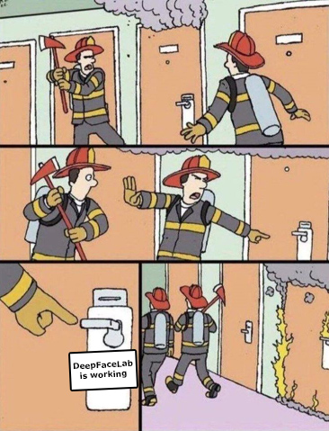

</td>

<td align="center" width="50%">

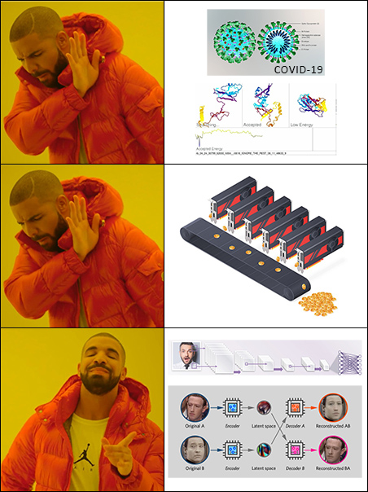

</td></tr>

<tr><td colspan=2 align="center">

<sub>#deepfacelab #deepfakes #faceswap #face-swap #deep-learning #deeplearning #deep-neural-networks #deepface #deep-face-swap #fakeapp #fake-app #neural-networks #neural-nets #tensorflow #cuda #nvidia</sub>

</td></tr>


</table>
